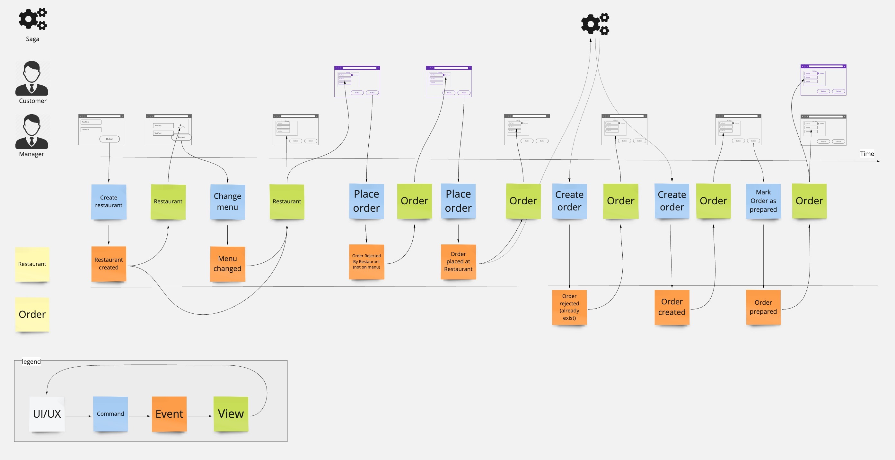

A demo/example project for the imaginary restaurant and order management.
It is demonstrating the usage of [fmodel-rust library](https://github.com/fraktalio/fmodel-rust).

It demonstrates how to run our unique domain and orchestrate it in an EventSourced/EventDriven way.


*this blueprint is an outcome of the [event-modeling](https://eventmodeling.org/posts/what-is-event-modeling/) process*

## Fmodel

This project is using [Fmodel](https://github.com/fraktalio/fmodel-rust) - Rust library. 
Find the documentation at [https://docs.rs/fmodel-rust/latest/fmodel_rust/](https://docs.rs/fmodel-rust/latest/fmodel_rust/)

**fmodel-rust** is:

- enabling functional and algebraic domain modeling with Rust programming language.
- inspired by DDD, EventSourcing and Functional programming communities, yet implements these ideas and
  concepts in idiomatic Rust, which in turn makes our code
    - less error-prone,
    - easier to understand,
    - easier to test,
    - type-safe,
    - memory-safe and
    - thread-safe.
- enabling illustrating requirements using examples
    - the requirements are presented as scenarios.
    - a scenario is an example of the system’s behavior from the users’ perspective,
    - and they are specified using the Given-When-Then structure to create a testable/runnable specification
        - Given `< some precondition(s) / events >`
        - When `< an action/trigger occurs / commands>`
        - Then `< some post condition / events >`

## Fstore-SQL

This project is using [PostgreSQL powered event store](https://github.com/fraktalio/fstore-sql), optimized for event
sourcing and event streaming.

**Fstore-SQL** is enabling event-sourcing and *pool-based* event-streaming patterns by using SQL (PostgreSQL) only.

- `event-sourcing` data pattern (by using PostgreSQL database) to durably store events
    - Append events to the ordered, append-only log, using `entity id`/`decider id` as a key
    - Load all the events for a single entity/decider, in an ordered sequence, using the `entity id`/`decider id` as a
      key
    - Support optimistic locking/concurrency
- `event-streaming` to concurrently coordinate read over a streams of events from multiple consumer instances
    - Support real-time concurrent consumers to project events into view/query models

## Tools

- [EventModeling](https://eventmodeling.org/posts/what-is-event-modeling/) - a method of describing systems using an
  example of how information has changed within them over time.

## Patterns

- EventSourcing
- CQRS


## Run the database
```shell
docker compose up -d
```

## Run the Application

```shell
cargo run
```

## Shutdown the database:
```shell
docker compose down -v
```

## Migration with Offline Mode is Enabled by Default

Migration with the [offline mode](https://github.com/launchbadge/sqlx/tree/main/sqlx-cli#force-building-in-offline-mode) is enabled by:

- setting `SQLX_OFFLINE` environment variable to true in `.env` file.
- invoking `cargo sqlx prepare` to save query metadata to `.sqlx` in the current directory.
- checking this directory into version control 

and an **active database connection will no longer be needed to build your project**.

## Migration in Online mode can be Enabled

Run the command below to install the sqlx-cli binary:
```shell
cargo install sqlx-cli
```

Push migration to the database
```shell
sqlx migrate run
```

to revert the latest migration:
```shell
sqlx migrate revert
```

Set `SQLX_OFFLINE` environment variable to false in `.env` file to disable offline mode.

**Now your queries will be checked against the database at compile time!**


## Try it out

Check the [test.http](test.http)!


---
Created with :heart: by [Fraktalio](https://fraktalio.com/)

Excited to launch your next IT project with us? Let's get started! Reach out to our team at `info@fraktalio.com` to
begin the journey to success.


